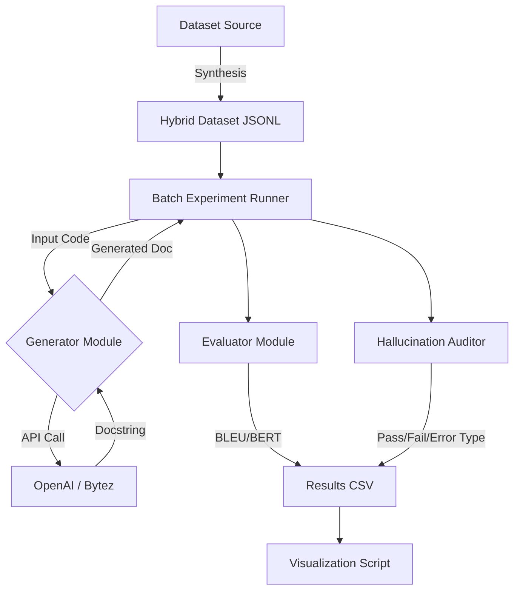

# AI-Generated Documentation Systems: Evaluation and Mitigation Strategies

[](https://)
[](https://www.python.org/)
[](https://streamlit.io/)

This repository contains the research and development for the "AI in Modern Software" (SW 403) course project. It implements an automated documentation system focusing on the "Legacy Code Crisis," comparing LLM performance on modern (Python) vs. legacy (COBOL) systems.


## 1. Project Description

The proliferation of Large Language Models (LLMs) presents a significant opportunity to automate documentation. However, this automation is fraught with risks, including factual inaccuracies and hallucinations.


## 2. Motivation & Objectives

  **Software Engineering:** Code documentation is vital for maintenance, yet often neglected. In legacy systems (e.g., COBOL), where original developers are unavailable, documentation is critical. LLMs often struggle with these less-common languages, leading to hallucinations.

  **Research Goal:** To quantify the "Hallucination Gap" between modern and legacy code generation and test if automated judges can reliably catch these errors.

ِBased on our initial literature review, this project seeks to answer the following research questions:

1.  **RQ1:** How can evaluation frameworks for AI-generated documentation be unified across domains (software vs. healthcare) while remaining sensitive to domain-specific priorities (e.g., technical accuracy vs. patient safety)?
2.  **RQ2:** What systematic patterns characterize AI documentation failures (hallucinations, omissions), and can these patterns be predicted or mitigated through targeted interventions (like structured prompting or RAG)?
3.  **RQ3:** How should human-in-the-loop (HITL) processes be structured to balance efficiency gains with the necessary quality assurance and accountability in critical systems?
4.  **RQ4:** What regulatory and governance frameworks are needed to balance innovation with safety and accountability for AI documentation in regulated industries?
5.  **RQ5:** Do AI documentation systems equitably serve diverse user populations (e.g., novice developers, non-native speakers), and how can biases in training data be identified and mitigated?

## 3. Project Phases
This project is structured into three main phases, aligned with the course timeline.
<table width="100%">
  <thead>
    <tr>
      <th align="left">Phase</th>
      <th align="left">Timeline</th>
      <th align="left">Deliverables</th>
      <th align="left" width="100%">Focus & Guidance</th>
    </tr>
  </thead>
  <tbody>
    <tr>
      <td valign="top" nowrap><strong>Phase 1</strong></td>
      <td valign="top" nowrap>Week 6</td>
      <td valign="top" nowrap>
        • Topic proposal (2–3 pages)<br>
        • Literature review summary<br>
        • Research question(s)
      </td>
      <td valign="top" width="100%">
        <strong>[COMPLETED]</strong> <br>Selected the task of evaluating AI-generated documentation. Conducted a literature review to identify the research gap, specifically the trade-off between efficiency and reliability, and defined our core research questions.
      </td>
    </tr>
    <tr>
      <td valign="top" nowrap><strong>Phase 2</strong></td>
      <td valign="top" nowrap>Week 10</td>
      <td valign="top" nowrap>
        • Prototype implementation<br>
        • Experimental setup & dataset<br>
        • Early results
      </td>
      <td valign="top" width="100%">
        <strong>[IN PROGRESS]</strong> <br>Develop a minimal viable prototype for either generating or evaluating AI documentation (e.g., for a specific legacy codebase or set of mock clinical notes). Collect data, run initial experiments, and critically analyze outputs. Document all errors, omissions, and hallucinations.
      </td>
    </tr>
    <tr>
      <td valign="top" nowrap><strong>Phase 3</strong></td>
      <td valign="top" nowrap>Week 14</td>
      <td valign="top" nowrap>
        • Complete Prototype<br>
        • Full research report (6–8 pages)<br>
        • Final demo and presentation<br>
        • Reflection
      </td>
      <td valign="top" width="100%">
        Write and present a full research paper summarizing our background, methods, and results from Phase 2. Include a thorough hallucination analysis and ethical aspects. The reflection will address whether our prototype/framework was able to enhance or better evaluate SOTA models.
      </td>
    </tr>
  </tbody>
</table>

## 4. Repository Structure

This project follows a modular structure to separate source code, experiments, and data.

```text
ai-doc-generator/
├── data/
│   ├── processed/            # Final clean datasets (JSONL)
│   └── raw/                  # Cached downloads from Hugging Face
├── experiments/
│   ├── logs/                 # Checkpoint CSVs (resumable runs)
│   ├── reports/              # Final aggregated metrics
│   ├── results/              # Generated graphs and analysis CSVs
│   ├── analyze_results.py    # Aggregates final metrics for reporting
│   ├── run_batch.py          # Main experiment execution script
│   ├── run_param_sweep.py    # Temperature comparison script
│   └── visualize.py          # Graph generation script
├── src/
│   ├── analysis.py           # Automated Hallucination Detection
│   ├── app.py                # Interactive Streamlit Prototype
│   ├── evaluator.py          # Metric calculation (BLEU, ROUGE, BERTScore)
│   └── generator.py          # LLM Integration (OpenAI + Bytez)
├── .env                      # API Keys (GitIgnored)
├── generate_dataset.py       # Dataset synthesis tool
├── requirements.txt          # Dependencies
├── templates.json            # Configurable prompt templates
├── README.md                 # Main Documentation
├── Report.md                 # Full Phase 2 Research Report
├── Sampling guide.md         # Statistical sampling instructions
└── TESTING_REPORT.md         # detailed testing logs
````

## 5\. Getting Started

Follow these steps to set up the environment.

### Prerequisites

  * **Python 3.11+** (Required for updated `bert_score` and `bytez` compatibility).
  * An API Key for **OpenAI** OR **Bytez**.

### Installation

1.  **Clone the repository**

    ```bash
    git clone https://github.com/aeldesouky/SW-403_AI-Generated-Documentation-Systems.git
    cd ai-doc-generator
    ```

2.  **Install Dependencies**

    ```bash
    pip install -r requirements.txt
    ```

3.  **Environment Configuration**
    Create a `.env` file in the root directory.

    ```env
    # Required: Choose one or both
    OPENAI_API_KEY=sk-...
    BYTEZ_KEY=bz-... 

    # Optional: For accessing gated datasets (The Stack)
    HF_TOKEN=hf_...
    ```

## 6\. Usage & Reproducibility

This section outlines how to reproduce the results found in **[Report.md](Report.md)**.

### A. Dataset Generation

Before running experiments, you must generate the hybrid dataset (Python + Real/Synthetic COBOL).

```bash
python generate_dataset.py --limit 1000
```

  * **Note:** This attempts to download real COBOL from The Stack. If `HF_TOKEN` is missing, it falls back to synthetic templates.
  * **Output:** `data/processed/full_experiment_set.jsonl`

### B. Running Experiments

We provide three modules for experimentation. Please refer to **[Experimentation\_Guide.md](https://github.com/aeldesouky/SW-403_AI-Generated-Documentation-Systems/blob/main/Experimentation_Guide.md)** and **[Sampling\_guide.md](https://github.com/aeldesouky/SW-403_AI-Generated-Documentation-Systems/blob/main/Sampling_guide.md)** for detailed flags and configuration options.

**1. Main Evaluation Pipeline**
Runs the generator and evaluator on the dataset.

```bash
python experiments/run_batch.py --sample 500 --delay 2.0
```

**2. Parameter Sweep**
Compares model performance across different temperatures (0.2, 0.5, 0.8).

```bash
python experiments/run_param_sweep.py
```

**3. Result Analysis**
Aggregates the CSV logs into the final tables used in the report.

```bash
python experiments/analyze_results.py
```

### C. Running the Prototype (GUI)

To demonstrate the tool interactively:

```bash
streamlit run src/app.py
```

  * **Features:** Real-time Code-to-Doc generation with live Hallucination Auditing.

## 7\. Architecture Diagram




## 8\. Team & Acknowledgements

  * **Ahmed Mostafa** (202201114)
  * **Seif Eldin** (202200973)
  * **Ahmed Emad** (202202231)

We would like to thank our supervisor, **Prof. Doaa Shawky**, for her guidance and support on this project.


## 9. Licensing & Data Acknowledgments

This research project relies on open-source datasets provided by the machine learning community. We gratefully acknowledge the authors and organizations who made this data available.

### A. The Stack (Legacy Code Data)
* **Dataset:** [bigcode/the-stack](https://huggingface.co/datasets/bigcode/the-stack)
* **Usage:** Sourced real-world COBOL files to evaluate legacy code performance.
* **License:** **BigCode OpenRAIL-M v1.0**.
* **Attribution:** Kocetkov et al., "The Stack: 3 TB of permissively licensed source code," 2022.
* **Compliance Note:** Access to this dataset is gated. Our data generation scripts (`generate_dataset.py`) implement authentication via Hugging Face tokens to strictly adhere to the OpenRAIL-M license terms regarding responsible use and attribution.

### B. CodeXGlue (Modern Code Data)
* **Dataset:** [google/code_x_glue_ct_code_to_text](https://huggingface.co/datasets/google/code_x_glue_ct_code_to_text) (Derived from Microsoft CodeXGlue).
* **Usage:** Sourced Python function-docstring pairs to establish baseline metrics.
* **License:** **CDLA-Permissive-v1.0** (Community Data License Agreement).
* **Attribution:** Lu et al., "CodeXGlue: A Machine Learning Benchmark Dataset for Code Understanding and Generation," 2021.
