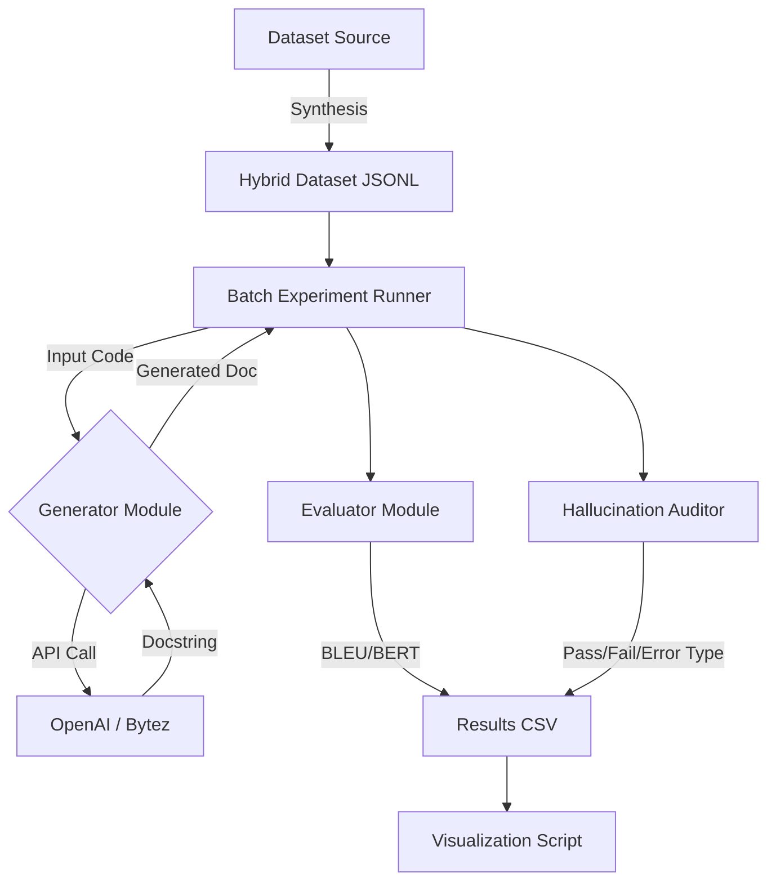

# AI-Generated Documentation Systems: Evaluation and Mitigation Strategies

[](https://)
[](https://www.python.org/)
[](https://streamlit.io/)

This repository contains the research and development for the "AI in Modern Software" (SW 403) course project. It implements an automated documentation system focusing on the "Legacy Code Crisis," comparing LLM performance on modern (Python) vs. legacy (COBOL) systems.

## 1. Project Description

The proliferation of Large Language Models (LLMs) presents a significant opportunity to automate documentation. However, this automation is fraught with risks, including factual inaccuracies and hallucinations.

**Phase 2 Focus:** We have developed a "Code Documenter" prototype that:
1.  **Generates** documentation for Code and Legacy systems using configurable LLMs (OpenAI & Bytez).
2.  **Evaluates** output using semantic metrics (BERTScore) and lexical metrics (BLEU/ROUGE).
3.  **Audits** reliability using an "LLM-as-a-Judge" framework to automatically detect hallucinations and omission errors.

## 2. Repository Structure

```text
ai-doc-generator/
├── data/
│   └── processed/            # Generated datasets (JSONL)
├── experiments/
│   ├── results/              # Output CSV logs and PNG graphs
│   ├── run_batch.py          # Main experiment script
│   ├── visualize.py          # Graph generation script
│   └── analyze_errors.py     # Hallucination analysis logic
├── src/
│   ├── app.py                # Interactive Streamlit Prototype (MVP)
│   ├── generator.py          # LLM Integration (OpenAI + Bytez)
│   ├── evaluator.py          # Metric calculation (BLEU, ROUGE, BERTScore)
│   └── analysis.py           # Automated Hallucination Detection
├── generate_dataset.py       # Dataset synthesis script
├── requirements.txt          # Python dependencies
└── README.md                 # Project documentation
````

## 3. Motivation & Objectives

  **Software Engineering:** Code documentation is vital for maintenance, yet often neglected. In legacy systems (e.g., COBOL), where original developers are unavailable, documentation is critical. LLMs often struggle with these less-common languages, leading to hallucinations.

  **Research Goal:** To quantify the "Hallucination Gap" between modern and legacy code generation and test if automated judges can reliably catch these errors.

ِBased on our initial literature review, this project seeks to answer the following research questions:

1.  **RQ1:** How can evaluation frameworks for AI-generated documentation be unified across domains (software vs. healthcare) while remaining sensitive to domain-specific priorities (e.g., technical accuracy vs. patient safety)?
2.  **RQ2:** What systematic patterns characterize AI documentation failures (hallucinations, omissions), and can these patterns be predicted or mitigated through targeted interventions (like structured prompting or RAG)?
3.  **RQ3:** How should human-in-the-loop (HITL) processes be structured to balance efficiency gains with the necessary quality assurance and accountability in critical systems?
4.  **RQ4:** What regulatory and governance frameworks are needed to balance innovation with safety and accountability for AI documentation in regulated industries?
5.  **RQ5:** Do AI documentation systems equitably serve diverse user populations (e.g., novice developers, non-native speakers), and how can biases in training data be identified and mitigated?

## 4. Project Phases
This project is structured into three main phases, aligned with the course timeline.
<table width="100%">
  <thead>
    <tr>
      <th align="left">Phase</th>
      <th align="left">Timeline</th>
      <th align="left">Deliverables</th>
      <th align="left" width="100%">Focus & Guidance</th>
    </tr>
  </thead>
  <tbody>
    <tr>
      <td valign="top" nowrap><strong>Phase 1</strong></td>
      <td valign="top" nowrap>Week 6</td>
      <td valign="top" nowrap>
        • Topic proposal (2–3 pages)<br>
        • Literature review summary<br>
        • Research question(s)
      </td>
      <td valign="top" width="100%">
        <strong>[COMPLETED]</strong> <br>Selected the task of evaluating AI-generated documentation. Conducted a literature review to identify the research gap, specifically the trade-off between efficiency and reliability, and defined our core research questions.
      </td>
    </tr>
    <tr>
      <td valign="top" nowrap><strong>Phase 2</strong></td>
      <td valign="top" nowrap>Week 10</td>
      <td valign="top" nowrap>
        • Prototype implementation<br>
        • Experimental setup & dataset<br>
        • Early results
      </td>
      <td valign="top" width="100%">
        <strong>[IN PROGRESS]</strong> <br>Develop a minimal viable prototype for either generating or evaluating AI documentation (e.g., for a specific legacy codebase or set of mock clinical notes). Collect data, run initial experiments, and critically analyze outputs. Document all errors, omissions, and hallucinations.
      </td>
    </tr>
    <tr>
      <td valign="top" nowrap><strong>Phase 3</strong></td>
      <td valign="top" nowrap>Week 14</td>
      <td valign="top" nowrap>
        • Complete Prototype<br>
        • Full research report (6–8 pages)<br>
        • Final demo and presentation<br>
        • Reflection
      </td>
      <td valign="top" width="100%">
        Write and present a full research paper summarizing our background, methods, and results from Phase 2. Include a thorough hallucination analysis and ethical aspects. The reflection will address whether our prototype/framework was able to enhance or better evaluate SOTA models.
      </td>
    </tr>
  </tbody>
</table>


## 5. Getting Started

Follow these steps to set up the environment and run the prototype.

### Prerequisites

  * Python 3.9+
  * An API Key for **OpenAI** OR **Bytez**.

### Installation

1.  **Clone the repo**

    ```bash
    git clone [https://github.com/aeldesouky/SW-403_AI-Generated-Documentation-Systems.git](https://github.com/aeldesouky/SW-403_AI-Generated-Documentation-Systems.git)
    cd ai-doc-generator
    ```

2.  **Install Dependencies**

    ```bash
    pip install -r requirements.txt
    ```

3.  **Environment Configuration**
    Create a `.env` file in the root directory. You can use either OpenAI or Bytez (or both).

    ```env
    # Option A: OpenAI
    OPENAI_API_KEY=sk-proj-xxxxxxxx

    # Option B: Bytez (Model agnostic)
    BYTEZ_KEY=a00xxxxxxxx
    ```

## 6. Usage & Reproducibility

### A. Running the Interactive Prototype (The MVP)

This launches the web interface where you can test the model in real-time.

```bash
streamlit run src/app.py
```

  * **Features:**
      * Real-time generation for Python and COBOL.
      * Live calculation of BLEU, ROUGE, and BERTScore (if ground truth is provided).
      * Toggle between OpenAI and Bytez backends.

### B. Reproducing the Experiments

To replicate the findings in our report, run the full batch pipeline:

**1. Generate the Dataset**
Creates a hybrid dataset of 20 Modern Python samples (CodeSearchNet) and 20 Synthetic COBOL samples.

```bash
python generate_dataset.py
```

  * *Output:* `data/processed/experiment_set.jsonl`

**2. Run Batch Evaluation**
Runs the LLM against the dataset, calculates metrics, and triggers the Hallucination Detector.

```bash
python experiments/run_batch.py
```

  * *Output:* `experiments/results/batch_run_v1.csv`

**3. Generate Visualizations**
Creates the distribution graphs used in the report.

```bash
python experiments/visualize.py
```

  * *Output:* `experiments/results/metric_dist.png` (BERTScore Comparison)
  * *Output:* `experiments/results/error_dist.png` (Hallucination Types)

## 7\. Architecture Diagram



## 8\. Team & Acknowledgements

  * **Ahmed Mostafa** (202201114)
  * **Ahmed Emad** (202202231)
  * **Seif Eldin** (202200973)

We would like to thank our supervisor, **Prof. Doaa Shawky**, for her guidance and support on this project.

